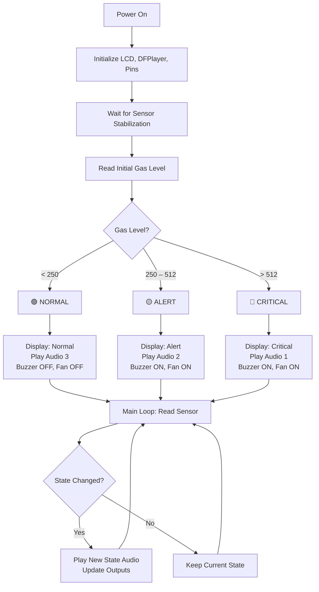

# 🛡️ Smart Gas Leak Detector with Voice Alerts (Arduino)

> An Arduino-based intelligent gas leak detection system featuring real-time monitoring, multi-level audio/voice alerts, automatic exhaust fan activation, and a live LCD status display.


---

## 📋 Table of Contents

- [Overview](#overview)
- [Features](#features)
- [Hardware Components](#hardware-components)
- [Circuit Diagram](#circuit-diagram)
- [Pin Configuration](#pin-configuration)
- [Software Dependencies](#software-dependencies)
- [SD Card Setup](#sd-card-setup)
- [Installation](#installation)
- [How It Works](#how-it-works)
- [Threshold Configuration](#threshold-configuration)
- [Troubleshooting](#troubleshooting)
- [Contributing](#contributing)
- [License](#license)

---

## Overview

**GasGuard** is a smart gas leak detection system built on the Arduino platform. It continuously monitors the surrounding air quality using an analog gas sensor (MQ-2/MQ-5/MQ-135) and responds with a three-tier alert system — **Normal**, **Alert**, and **Critical** — each with distinct audio voice announcements, buzzer warnings, and automatic exhaust fan control.

Unlike basic gas detectors that only beep, GasGuard provides **clear voice announcements** through a DFPlayer Mini MP3 module, making it accessible and easy to understand even from a distance. The system also features intelligent state tracking, ensuring audio alerts are played only once per state transition to avoid repetitive and annoying playback.

---

## ✨ Features

| Feature | Description |
|---|---|
| 🔍 **Real-Time Gas Monitoring** | Continuously reads analog gas sensor values and displays them live on the LCD |
| 🔊 **Voice Alerts** | Plays distinct MP3 voice announcements for each danger level via DFPlayer Mini |
| 📟 **16x2 LCD Display** | Shows current gas concentration level and system status in real time |
| 🚨 **Buzzer Alarm** | Activates a loud buzzer during Alert and Critical states |
| 🌀 **Automatic Exhaust Fan** | Turns on an exhaust fan automatically when gas levels are elevated |
| 🧠 **Smart State Tracking** | Prevents repeated audio playback — alerts trigger only on state transitions |
| ⚡ **Three-Tier Alert System** | Normal → Alert → Critical, with unique responses for each level |
| 🔄 **Recovery Detection** | Announces return to "Normal" status when gas levels drop back to safe range |

---

## 🔧 Hardware Components

| Component | Quantity | Description |
|---|:---:|---|
| Arduino Uno/Nano | 1 | Main microcontroller board |
| MQ-2 / MQ-5 / MQ-135 Gas Sensor | 1 | Analog gas/smoke sensor module |
| DFPlayer Mini MP3 Module | 1 | MP3 playback module for voice alerts |
| 16x2 I2C LCD Display | 1 | Displays gas level and status (I2C address: `0x27`) |
| Speaker (8Ω, 3W) | 1 | Connected to DFPlayer Mini for audio output |
| Buzzer (Active) | 1 | For audible alarm |
| DC Fan / Exhaust Fan | 1 | For gas ventilation (with relay/transistor driver) |
| Relay Module (5V) | 1 | To control the fan (if needed) |
| Micro SD Card (FAT32) | 1 | Stores MP3 audio files for the DFPlayer |
| 1kΩ Resistor | 1 | For DFPlayer RX line (recommended) |
| Breadboard & Jumper Wires | — | For prototyping connections |
| 5V Power Supply | 1 | To power the system |

---

## 🔌 Pin Configuration

| Arduino Pin | Component | Function |
|:---:|---|---|
| `A0` | Gas Sensor (Analog Out) | Reads gas concentration level |
| `D3` | Buzzer | Alarm output (PWM capable) |
| `D7` | Fan / Relay | Exhaust fan control |
| `D10` | DFPlayer Mini (TX → Arduino RX) | Software Serial RX |
| `D11` | DFPlayer Mini (RX ← Arduino TX) | Software Serial TX |
| `A4 (SDA)` | I2C LCD | Data line |
| `A5 (SCL)` | I2C LCD | Clock line |

> [!IMPORTANT]
> Place a **1kΩ resistor** in series on the DFPlayer Mini's RX line (Arduino pin 11 → resistor → DFPlayer RX) to prevent communication issues.

---

## Circuit Diagram

```
                        ┌─────────────────────┐
                        │     Arduino Uno      │
                        │                      │
   MQ Sensor ──────────►│ A0            D3  ──►│──── Buzzer (+)
                        │                      │
                        │ A4 (SDA) ◄───────────│──── LCD SDA
                        │ A5 (SCL) ◄───────────│──── LCD SCL
                        │                      │
                        │ D10 (RX) ◄───────────│──── DFPlayer TX
                        │ D11 (TX) ────[1kΩ]──►│──── DFPlayer RX
                        │                      │
                        │ D7 ──────────────────│──── Relay → Fan
                        │                      │
                        │ 5V  ─────────────────│──── VCC (all modules)
                        │ GND ─────────────────│──── GND (all modules)
                        └─────────────────────┘

   DFPlayer Mini ────── Speaker (8Ω, 3W)
```

---

## 📦 Software Dependencies

Install the following libraries via the Arduino Library Manager (`Sketch → Include Library → Manage Libraries`):

| Library | Author | Purpose |
|---|---|---|
| [LiquidCrystal_I2C](https://github.com/johnrickman/LiquidCrystal_I2C) | John Rickman | I2C LCD display driver |
| [DFRobotDFPlayerMini](https://github.com/DFRobot/DFRobotDFPlayerMini) | DFRobot | DFPlayer Mini MP3 module driver |
| **SoftwareSerial** | Arduino (built-in) | Serial communication with DFPlayer |

---

## 💾 SD Card Setup

The DFPlayer Mini requires a specific folder and file naming structure on the micro SD card.

### Folder Structure

```
SD Card (FAT32)
└── mp3/
    ├── 0001.mp3    ← Critical danger alert audio
    ├── 0002.mp3    ← High gas alert audio
    └── 0003.mp3    ← Normal / all clear audio
```

### Audio File Details

| File | Track # | Trigger Condition | Suggested Content |
|---|:---:|---|---|
| `0001.mp3` | 1 | Gas level > 512 (Critical) | *"Warning! Critical gas levels detected. Evacuate immediately."* |
| `0002.mp3` | 2 | Gas level 250–512 (Alert) | *"Caution! Elevated gas levels detected. Please ventilate the area."* |
| `0003.mp3` | 3 | Gas level < 250 (Normal) | *"Gas levels are normal. Environment is safe."* |

> [!NOTE]
> - The SD card **must** be formatted as **FAT32**.
> - Files must be placed inside a folder named exactly **`mp3`** (lowercase).
> - File names must follow the `0001.mp3`, `0002.mp3` pattern (4-digit zero-padded).
> - You can record your own voice alerts or use a text-to-speech service to generate the MP3 files.

---

## 🚀 Installation

1. **Clone the repository**
   ```bash
   git clone https://github.com/yourusername/GasGuard-Arduino.git
   ```

2. **Open in Arduino IDE**
   - Open `GasGuard-Arduino.ino` in the Arduino IDE.

3. **Install libraries**
   - Go to `Sketch → Include Library → Manage Libraries`
   - Search and install: `LiquidCrystal I2C`, `DFRobotDFPlayerMini`

4. **Prepare the SD card**
   - Format a micro SD card as FAT32.
   - Create the `mp3/` folder and add your audio files (`0001.mp3`, `0002.mp3`, `0003.mp3`).
   - Insert the SD card into the DFPlayer Mini module.

5. **Wire the circuit**
   - Connect all components as described in the [Pin Configuration](#pin-configuration) and [Circuit Diagram](#circuit-diagram) sections.

6. **Upload**
   - Select your board (`Tools → Board → Arduino Uno`) and the correct COM port.
   - Click **Upload**.

7. **Monitor**
   - Open the Serial Monitor (`Tools → Serial Monitor`, baud rate: `9600`) to view real-time gas sensor readings.

---

## 🧠 How It Works

### System Flowchart



### State Machine

The system operates on three states with smart transition detection:

| State | Gas Level | LCD Display | Buzzer | Fan | Audio Track |
|---|:---:|---|:---:|:---:|:---:|
| 🟢 **Normal** | < 250 | `Status: Normal` | OFF | OFF | Track 3 |
| 🟡 **Alert** | 250 – 512 | `ALERT! High Gas!` | ON | ON | Track 2 |
| 🔴 **Critical** | > 512 | `CRITICAL DANGER!` | ON | ON | Track 1 |

### Key Design Decisions

- **State tracking (`prevState`)**: Audio alerts play only once when entering a new state, avoiding repetitive announcements.
- **Recovery notification**: When gas drops from Alert/Critical back to Normal, a "safe" audio message (Track 3) is played to confirm the all-clear.
- **Sensor stabilization delay**: A 2-second warm-up delay after boot ensures accurate initial readings from the gas sensor.
- **Non-blocking audio waits**: `delay()` calls after `playMp3Folder()` ensure the audio completes before the system continues.

---

## ⚙️ Threshold Configuration

You can customize the gas level thresholds by modifying these values in the source code:

```cpp
// In loop() and setup():
if (sensorValue > 512)       // CRITICAL threshold
else if (sensorValue > 250)  // ALERT threshold
else                         // NORMAL (below 250)
```

> [!TIP]
> **Calibration Tip**: Use the Serial Monitor to observe baseline sensor readings in clean air. Adjust the thresholds based on your specific sensor model and environment. Different MQ sensor variants (MQ-2, MQ-5, MQ-135) will produce different baseline values.

### Recommended Calibration Steps

1. Power on the system in a **clean air** environment.
2. Wait 5–10 minutes for the sensor to fully warm up.
3. Note the baseline reading on the Serial Monitor (typically 50–200 for clean air).
4. Set your **Alert threshold** to ~2x the baseline value.
5. Set your **Critical threshold** to ~4x the baseline value.

---

## 🔍 Troubleshooting

| Problem | Possible Cause | Solution |
|---|---|---|
| LCD shows nothing | Wrong I2C address | Run an [I2C scanner sketch](https://playground.arduino.cc/Main/I2cScanner/) and update the address in the code |
| DFPlayer not found | Wiring issue or missing resistor | Check TX/RX connections; add a 1kΩ resistor on the RX line |
| No audio plays | SD card format or file naming | Ensure FAT32 format, `mp3/` folder exists, files named `0001.mp3` etc. |
| Sensor reads 0 or 1023 | Loose connection or faulty sensor | Check A0 wiring; ensure sensor module VCC and GND are connected |
| Fan doesn't turn on | Direct pin drive insufficient | Use a relay module or transistor (TIP120/MOSFET) to drive the fan |
| Buzzer is quiet | Passive buzzer used | Use an **active** buzzer, or add `tone()` for passive buzzers |

---

## 🤝 Contributing

Contributions are welcome! Here's how you can help:

1. **Fork** this repository
2. **Create** your feature branch (`git checkout -b feature/amazing-feature`)
3. **Commit** your changes (`git commit -m 'Add amazing feature'`)
4. **Push** to the branch (`git push origin feature/amazing-feature`)
5. **Open** a Pull Request

### Ideas for Improvement

- [ ] Add Wi-Fi/Bluetooth connectivity (ESP32) for remote monitoring
- [ ] Implement a mobile app dashboard
- [ ] Add data logging to an SD card with timestamps
- [ ] Integrate multiple gas sensors for multi-gas detection
- [ ] Add an OLED display upgrade with graphical gas level bars
- [ ] Implement SMS/email alerts via GSM or IoT platforms (Blynk, ThingSpeak)

---

## 📄 License

This project is licensed under the MIT License — see the [LICENSE](LICENSE) file for details.

---

## 👤 Author

**Karthik**
- GitHub: [@KarthikCH11](https://github.com/KarthikCH11)

---

<p align="center">
  Made with ❤️ and Arduino
</p>
